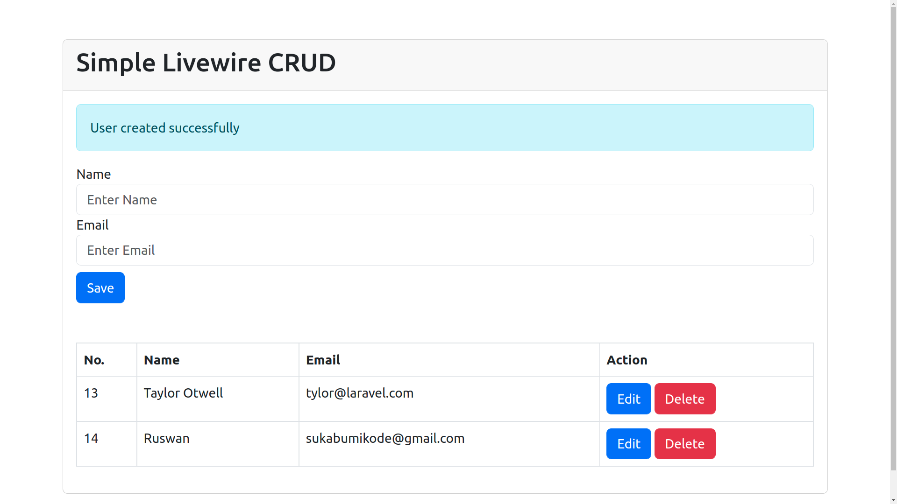

<p align="center"></p>

# Simple Livewire CRUD

This repository contains a simple CRUD (Create, Read, Update, Delete) application built using Livewire. Livewire is a full-stack framework for Laravel that enables developers to build dynamic, reactive interfaces using only PHP.

## Features

-   Create new records
-   Read existing records
-   Update existing records
-   Delete records

## Installation

1. Clone the repository:

```bash
git clone https://github.com/ruswan/simple-livewire-crud.git
```

2. Navigate to the project directory:

```bash
cd simple-livewire-crud
```

3. Install the dependencies using Composer:

```bash
composer install
```

4. Create a copy of the `.env.example` file and rename it to `.env`:

```bash
cp .env.example .env
```

5. Generate the application key:

```bash
php artisan key:generate
```

6. Configure the database connection in the `.env` file with your database credentials.

7. Run the database migrations:

```bash
php artisan migrate
```

8. Start the development server:

```bash
php artisan serve
```

9. Visit `http://localhost:8000` in your web browser to access the application.

## Usage

The application provides a user interface to perform CRUD operations on a specific resource. Simply navigate to the homepage and use the provided forms and buttons to interact with the records.

## Contributing

Contributions are welcome! If you would like to contribute to this project, please follow these steps:

1. Fork the repository.
2. Create a new branch for your feature or bug fix.
3. Make your changes and commit them with descriptive messages.
4. Push your changes to your forked repository.
5. Submit a pull request to the main repository.

Please ensure that your code follows the existing coding style and conventions. Also, include tests for any new features or bug fixes.

## License

This project is licensed under the [MIT License](LICENSE). Feel free to use and modify it according to your needs.

## Acknowledgments

-   [Livewire](https://laravel-livewire.com/) - A full-stack framework for Laravel.
-   [Laravel](https://laravel.com/) - The PHP framework used for this project.

## Contact

If you have any questions, suggestions, or feedback, please feel free to reach out to the project maintainer at [sukabumikode@gmail.com](mailto:sukabumikode@gmail.com).
